# Autonomous Quadcopter UAV — Flight Control, Telemetry & FPV — Engineering Guide

Designed, assembled and flight-tested an autonomous quadcopter with GPS waypoint navigation, MAVLink telemetry to a ground control station, failsafe protection, and a live 5.8 GHz video link for remote surveillance.

## Visual overview

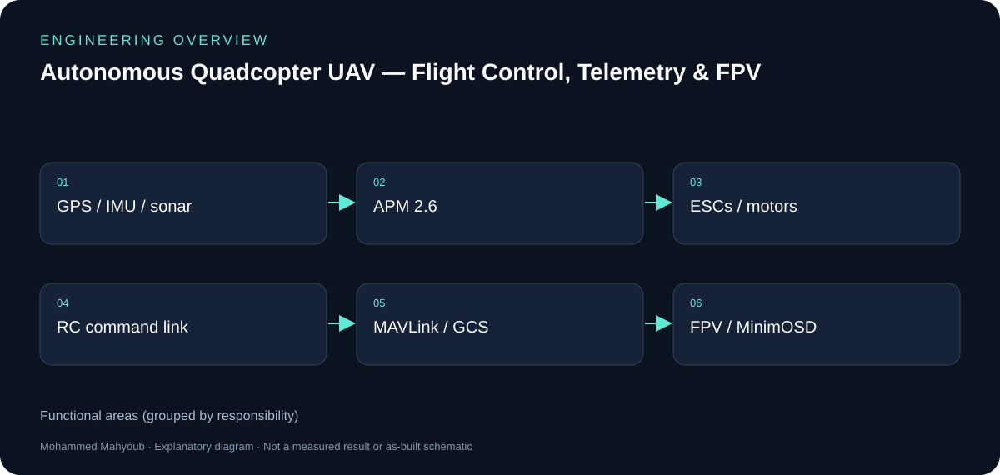

*New explanatory diagram; grouped responsibilities, not an as-built schematic or test result.*

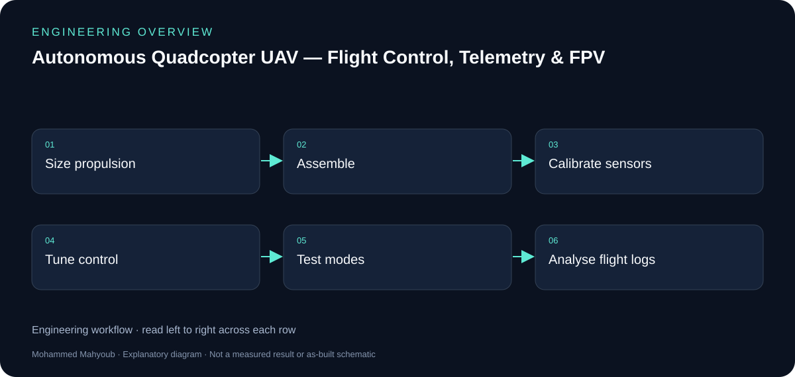

*New explanatory workflow; a documentation aid, not evidence that every proposed check was performed.*

## Control, telemetry and video

The APM flight controller reads navigation and attitude sensors and drives the propulsion system. RC commands, MAVLink telemetry and the 5.8 GHz FPV stream are separate paths. Keeping those paths explicit explains why a working video link does not prove command or navigation health.

## Testing as an engineering loop

The report-derived material covers calibration, PID tuning and flight-mode testing. Log-driven fixes include IMU re-centring, vibration damping and barometer shielding, sonar filtering and compass placement. Before/after figures should be read with the matching fault discussion in the README.

## Scope of reported values

Propulsion values from eCalc are estimates; telemetry range and flight observations come from the documented tests. Tuned parameters describe this build and are not universal settings for other aircraft. The new overview diagram simplifies the original wiring and does not replace the build documentation.

## Evidence to review or collect

The following are suggested review checks. A checklist entry is not a claimed pass result.

- Sensor and RC calibration.
- Propulsion estimate versus observed behaviour.
- Mode/failsafe test record.
- Before/after logs for each reported fix.

## Source gallery

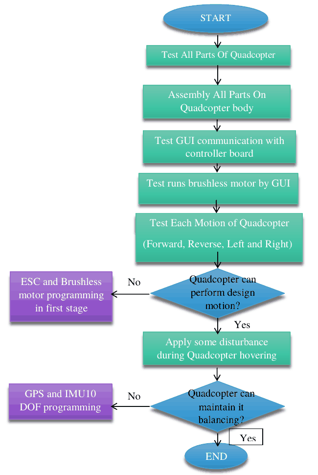

*design and test flow.*

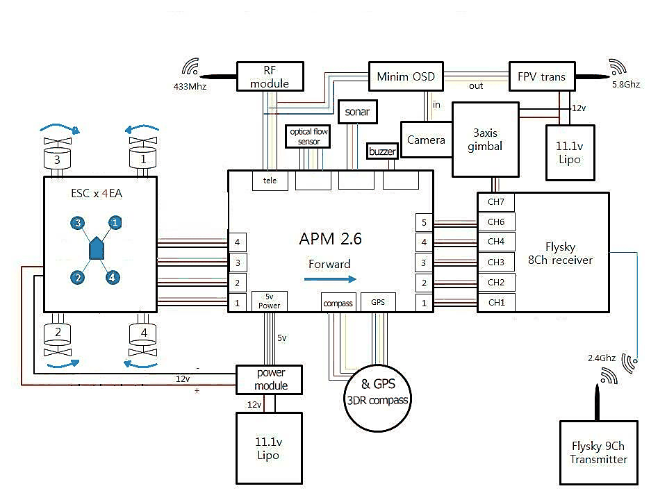

*system block diagram.*

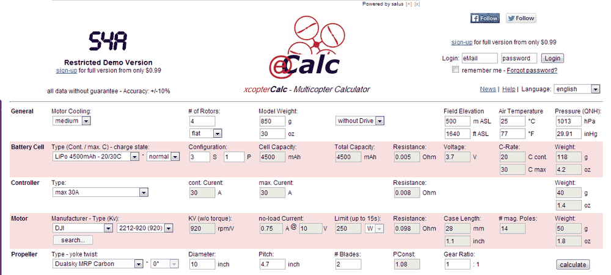

*ecalc inputs.*

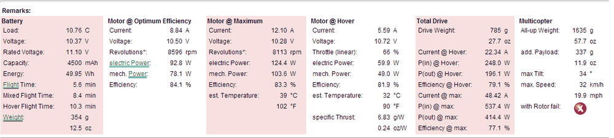

*ecalc results.*

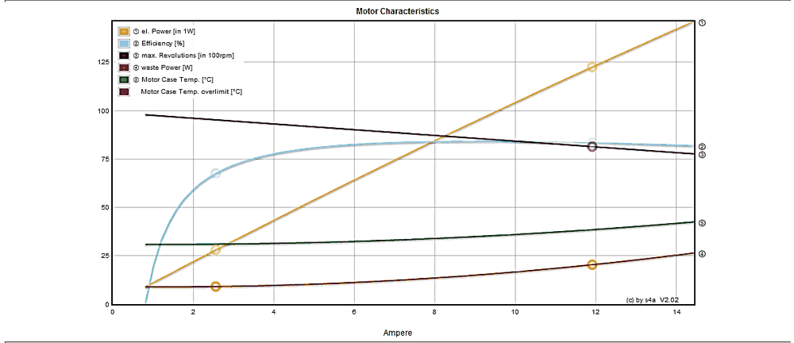

*ecalc motor efficiency.*

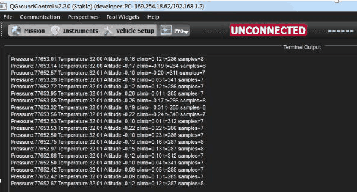

*barometer test.*

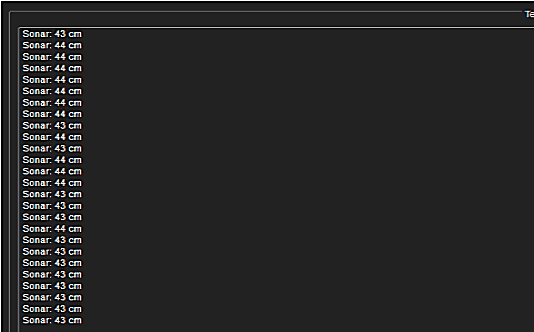

*sonar test.*

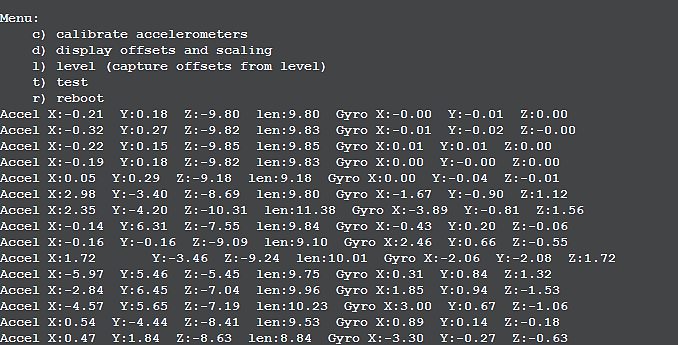

*accelerometer test.*

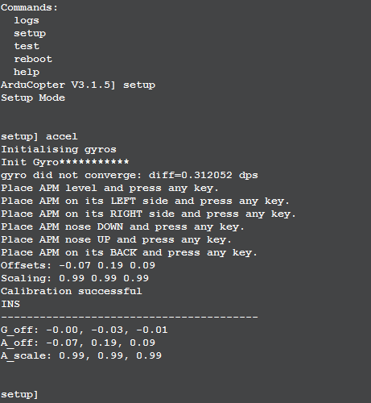

*accelerometer calibration cli.*

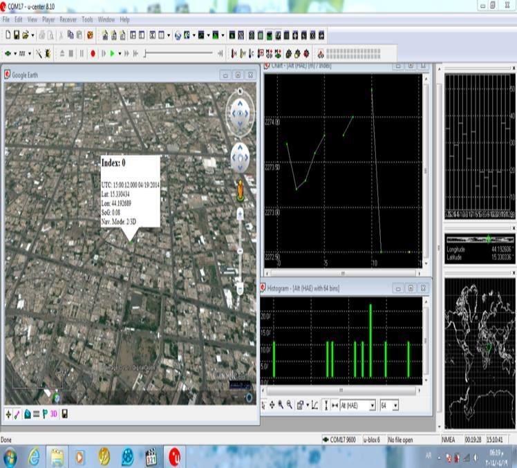

*gps test.*

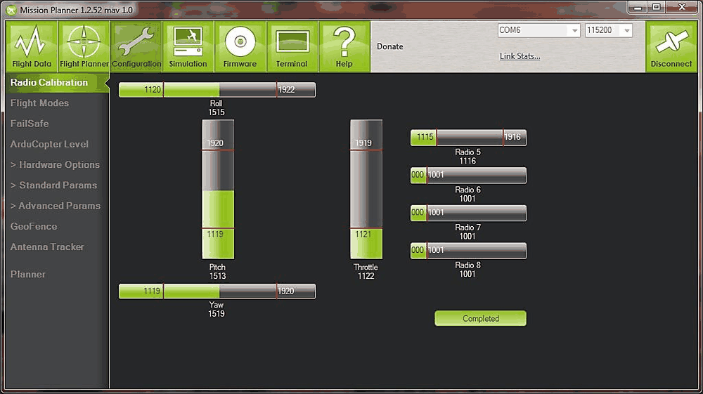

*rc calibration.*

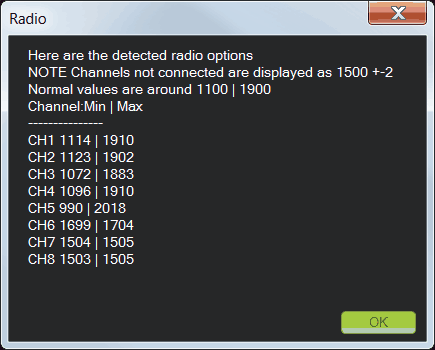

*rc calibration summary.*

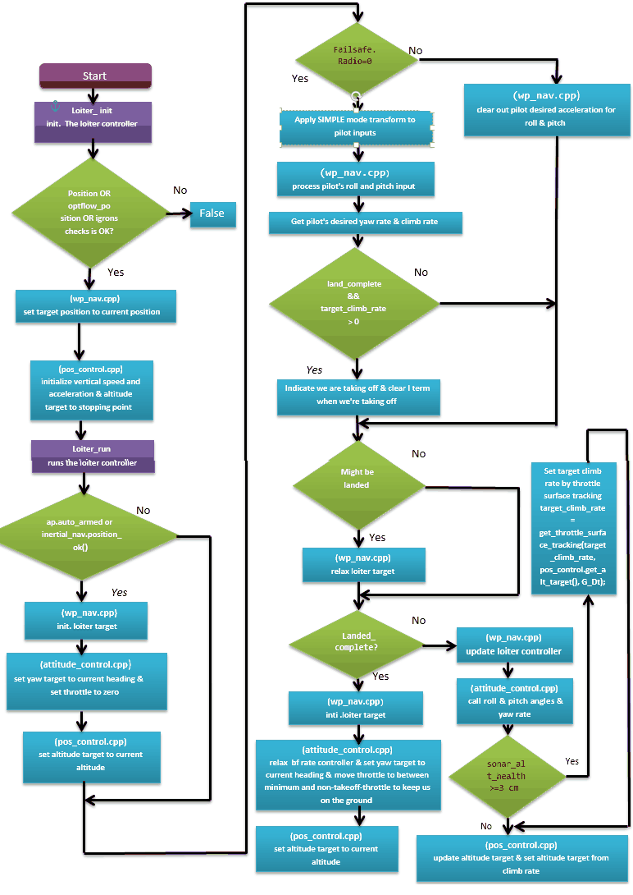

*loiter flowchart.*

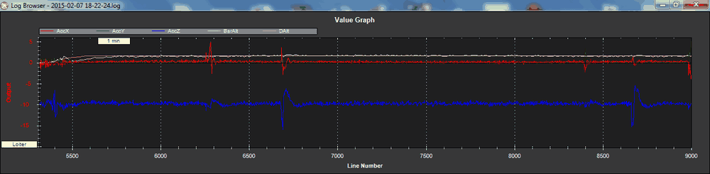

*loiter vibration before.*

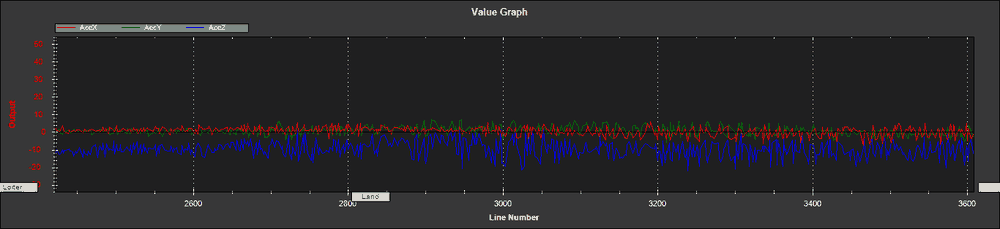

*loiter vibration after.*

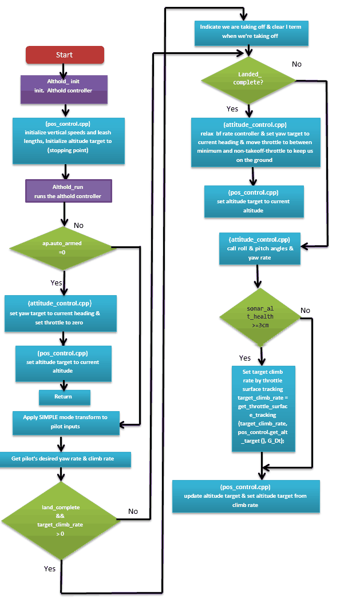

*althold flowchart.*

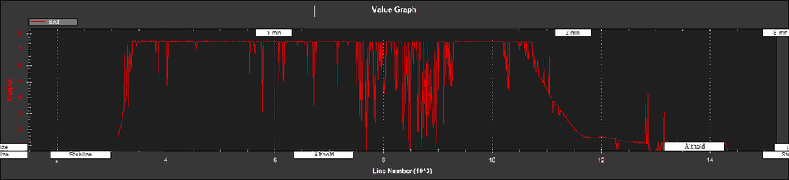

*sonar noise before.*

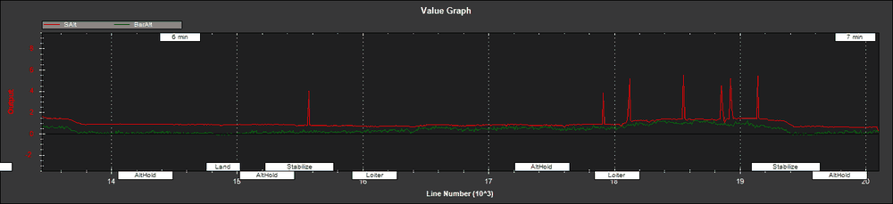

*sonar after low pass.*

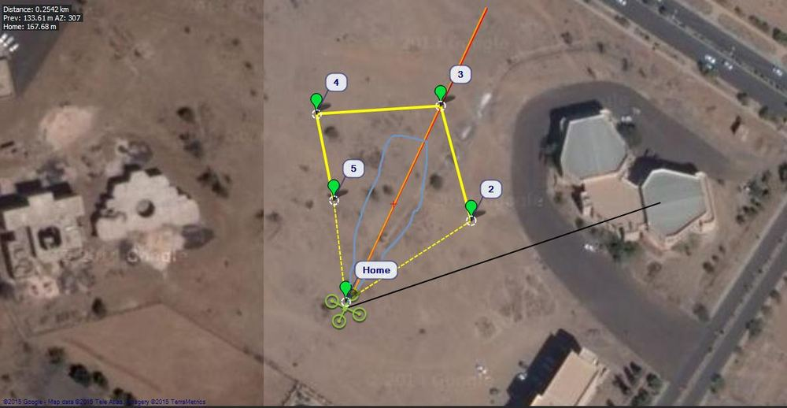

*auto heading error.*

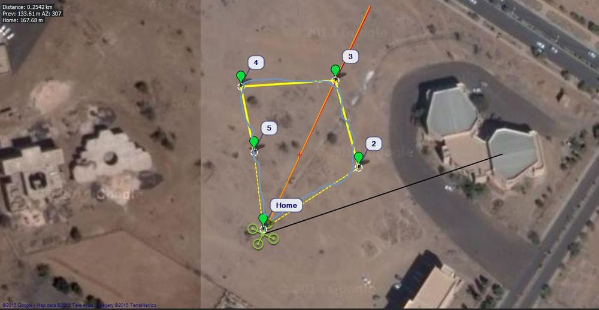

*auto heading corrected.*

## Sources and provenance

- [Published portfolio description](https://mahyoub88.github.io/#proj-quadcopter-uav).
- [Project README](../README.md) and existing repository files.
- [LinkedIn projects](https://www.linkedin.com/in/mohammed-mahyoub/details/projects/): supplementary descriptions and project media.
- New SVG figures and explanatory text were authored for this documentation update; they are not original photographs or new measured results.
